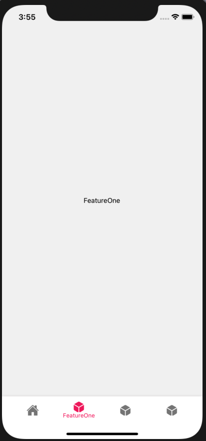

[<h1 align="center"></h1>](https://invoiss.com)

<div align="center">
<h1>Welcome to Invoiss React-Native Technical Interview</h1> 
</div> 

## Installation

<div align="center">
  
Make sure your environment is set up correctly according to the [React Native Set-Up Docs](https://reactnative.dev/docs/environment-setup) 
before you attend the interview question
</div> 


<p>Fork this Repo, open the project and cd in the project folder and :  </p>

```bash
npm install
```
<p>cd in ios folder and run :  </p>

```bash
pod install
```

<p>cd back to root project and run :  </p>

```bash
npx react-native run-ios
```
- <p>We are going to run this on an iOS simulator, so you will need a mac.</p>

<h3 align="center">
You should be able to see this App Screen once your app is loaded on iOS Simulator. </br></br>

</h3>

## Your Task : As part of your interview, you must complete all 3 Tasks below and deliver it, before the due date.

<h1>Task A, Horrizontal Scrolling Effect </h1>

- Create this feature below within the given boiler plate app.
  *Note:* if the gif below doesnt load correctly, try this link for the full demo video : [Demo Video](http://www.invoiss.com/assets/pages/invoiss-main-page/assets/video/app-example.mp4)
  
 <p align="center"> </p>

**Create this feature in the "Feature 1" Screen of the boilerplate App.**

- Your task is to a create a custom horizontally scrolling category section so that as the user scrolls down the page, then the categories on the top also scroll   horizontally and shift over. create this feature using a map/filter and not a FlatList. User should also be able to click on any of these categories and the     page should scroll down to that section.

- You may use the Reanimated API V2.


<h1>Task B, Document Uploading </h1>

- Create this feature below within the given boiler plate app.
  *Note:* if the gif below doesnt load correctly, try this link for the full demo video : [Demo Video](https://www.invoiss.com/assets/pages/invoiss-main-page/assets/video/app-example2.mp4)
 <p align="center"></p>

**Create this feature in the "Feature 2" Screen of the boilerplate App.**
- Add a button that pops a modal which asks the user what kind of document they would like to upload, they can choose a picture, or video from their gallary, and   upload it to the empty screen.


<h1>Task C, Shared Element Transition </h1>

- Create this feature below within the given boiler plate app.
  *Note:* if the gif below doesnt load correctly, try this link for the full demo video : [Demo Video](https://www.invoiss.com/assets/pages/invoiss-main-page/assets/video/app-example3.mp4)
 <p align="center"></p>

**Create this feature in the "Feature 3" Screen of the boilerplate App.**
- You may create a Card that once it is clicked, it wil fill the full page. And once full page, the page can be dragged around and let go to fit back to card position.
- You may use the react-native-shared-element and gesture handler/transition API to implement this.

<h1> </h1>

- Please keep in mind that, we love to encourage our developerts to seek google and the online dev community for answers and help. But these tasks above are what we expect from a developer to do on their own when hired with us for this react native role. 

<div align="center">
<h2>Once you are done, commit your changes, push it to your own forked repo, and create a pull request to this repo and we will take it from there! </h2> 
Thanks for applying to Invoiss!
</div> 


